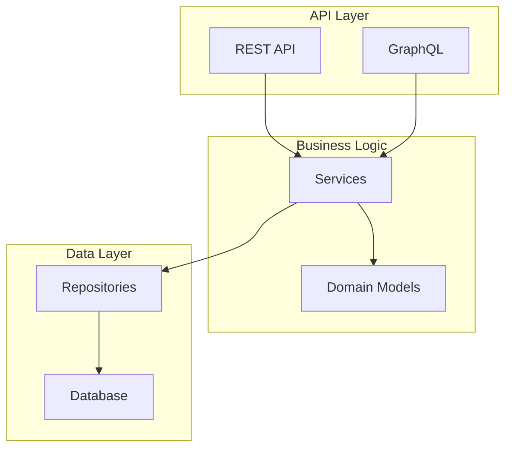
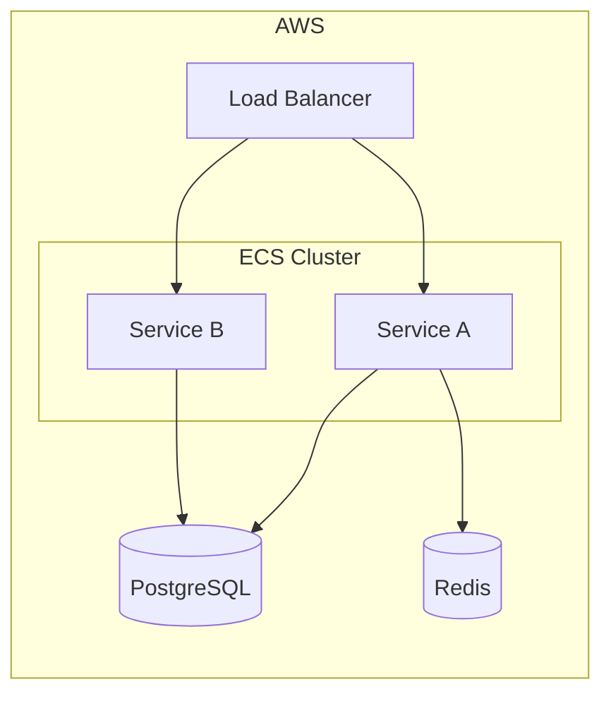
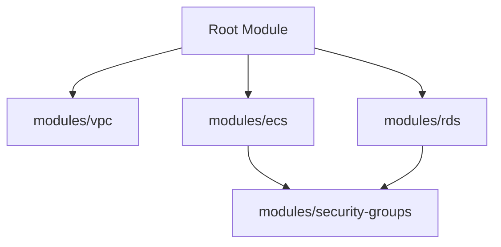

# Codemap Generator

Generate `CODEMAP.md` files that help humans and AI agents navigate codebases.

## Output Separation

- **CODEMAP.md** = Auto-generated navigation map (this skill creates/updates)
- **ARCHITECTURE.md** = Hand-written design decisions (never touch)

## Workflow

### Phase 1: Project Analysis

1. **Count files** to determine project size:
   - Use Glob with pattern `**/*` excluding vendored paths
   - Exclude: `node_modules/`, `vendor/`, `__pycache__/`, `target/`, `.terraform/`, `.*`
   - Count results to determine depth

2. **Detect project type(s)**:
   - Check for IaC patterns (Terraform, Ansible, K8s, etc.)
   - Check for application code (package.json, go.mod, requirements.txt, etc.)
   - Projects can be mixed (app + infra)

3. **Set depth based on file count**:
   | Files | Depth | Output |
   |-------|-------|--------|
   | <50 | shallow | Single root CODEMAP.md |
   | 50-500 | medium | Root + key directories |
   | >500 | deep | Root + 2 levels, skip vendored |

### Phase 2: Existing File Check

**STOP. Check for existing CODEMAP.md before proceeding.**

Before generating, check if `CODEMAP.md` exists.

**If exists**: Use `AskUserQuestion` with options:
- Overwrite completely
- Merge/update (preserve manual additions)
- Abort

**If not exists**: Proceed to generation.

**Do NOT proceed to Phase 3 until resolved.**

### Phase 3: Content Generation

Generate sections based on what's detected:

#### For Application Code

1. **Tech Stack** - languages, frameworks, key dependencies
2. **Directory Structure** - annotated tree with purpose per directory
3. **Entry Points** - main files, CLI commands, API servers
4. **Code Architecture Diagram** - mermaid showing component relationships
5. **Key Files Reference** - important files with one-line descriptions

#### For Infrastructure Code

1. **IaC Stack** - Terraform, Ansible, K8s, etc.
2. **Infrastructure Topology Diagram** - mermaid showing resource relationships
3. **Module/Role Hierarchy Diagram** - mermaid showing code organization
4. **Resource Inventory** - what's managed, providers used

#### For Mixed Repos

Include both sections with clear delineation.

### Phase 4: Output

Write `CODEMAP.md` to project root (and subdirectories if depth warrants).

## Detection Patterns

### Application Code

| Indicator | Stack |
|-----------|-------|
| `package.json` | Node.js/JavaScript/TypeScript |
| `go.mod` | Go |
| `Cargo.toml` | Rust |
| `requirements.txt`, `pyproject.toml`, `setup.py` | Python |
| `pom.xml`, `build.gradle` | Java |
| `Gemfile` | Ruby |
| `composer.json` | PHP |
| `*.csproj`, `*.sln` | .NET |

### Infrastructure as Code

| Indicator | Tool | Analysis Method |
|-----------|------|-----------------|
| `*.tf` files | Terraform | Parse resources, modules, use `terraform graph` if initialized |
| `playbook*.yml` + `roles/` | Ansible | Map playbooks → roles → tasks |
| `kind:` in YAML, `kustomization.yaml` | Kubernetes | Parse manifests, map services/deployments |
| `Chart.yaml` | Helm | Parse templates, values |
| `Pulumi.yaml` | Pulumi | Treat like application code |
| `AWSTemplateFormatVersion` | CloudFormation | Parse resources, nested stacks |
| `docker-compose.yml` | Docker Compose | Map services, networks, volumes |

## Mermaid Diagram Patterns

### Code Architecture (Component Relationships)



### Infrastructure Topology



### Module Hierarchy (Terraform)



## Analysis Techniques

### Import Graph (AST-based)

For JS/TS:
```bash
ast-grep --pattern 'import $_ from "$SOURCE"' --lang ts
ast-grep --pattern 'require("$SOURCE")' --lang js
```

For Python:
```bash
ast-grep --pattern 'from $MODULE import $_' --lang python
ast-grep --pattern 'import $MODULE' --lang python
```

For Go:
```bash
ast-grep --pattern 'import "$PKG"' --lang go
```

### Entry Point Detection

| File Pattern | Type |
|--------------|------|
| `main.go`, `main.py`, `main.ts` | Application entry |
| `index.ts`, `index.js` | Module entry |
| `cli.py`, `cli.ts`, `cmd/` | CLI entry |
| `server.ts`, `app.py`, `api/` | Server entry |
| `*_test.go`, `*.test.ts`, `test_*.py` | Test entry |

### Terraform Resource Parsing

Extract from `*.tf`:
- `resource` blocks → managed infrastructure
- `module` blocks → dependencies
- `provider` blocks → cloud targets
- `data` blocks → external references

If `.terraform/` exists and `terraform init` has been run, can use:
```bash
terraform graph | # convert DOT to mermaid
```

**Note**: `terraform graph` requires initialized state. Skip if `.terraform/` missing or init incomplete.

## Output Template

```markdown
# Codemap

> Auto-generated navigation map. Last updated: {date}
> For design decisions, see ARCHITECTURE.md (if exists)

## Tech Stack

- **Languages**: {detected languages}
- **Frameworks**: {detected frameworks}
- **Infrastructure**: {detected IaC tools}

## Directory Structure

\`\`\`
{annotated tree}
\`\`\`

## Code Architecture

\`\`\`mermaid
{component diagram}
\`\`\`

## Infrastructure Topology

\`\`\`mermaid
{infra diagram}
\`\`\`

## Entry Points

| Entry | Purpose | Command |
|-------|---------|---------|
| {file} | {purpose} | {how to run} |

## Key Files

| File | Purpose |
|------|---------|
| {path} | {description} |
```

## Edge Cases

- **Monorepos**: Detect workspace patterns (lerna, nx, turborepo, go workspaces), generate per-package maps
- **No clear structure**: Generate minimal map with warnings about organization
- **Vendored code**: Always exclude from analysis (node_modules, vendor, .terraform, __pycache__)
- **Generated code**: Detect and label (protobuf, OpenAPI, etc.)
